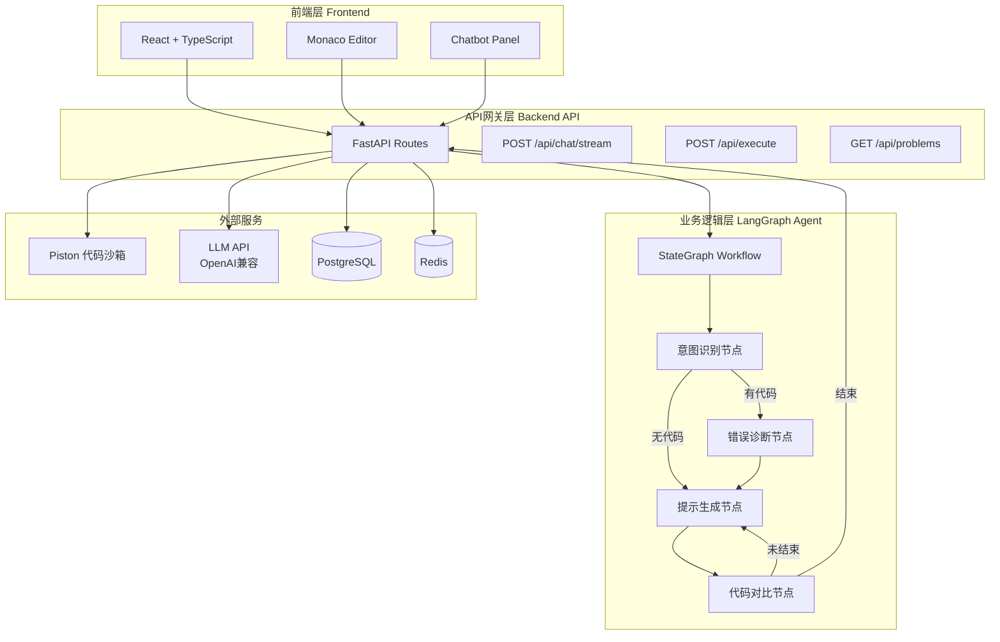
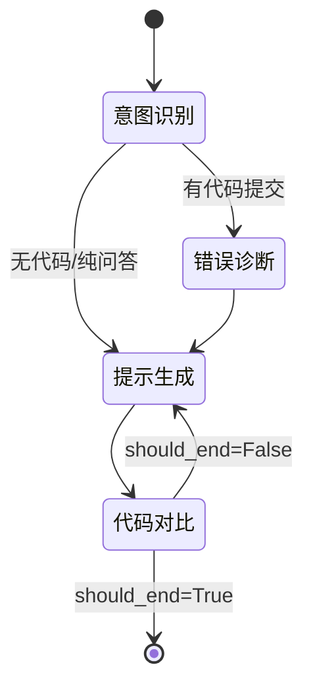
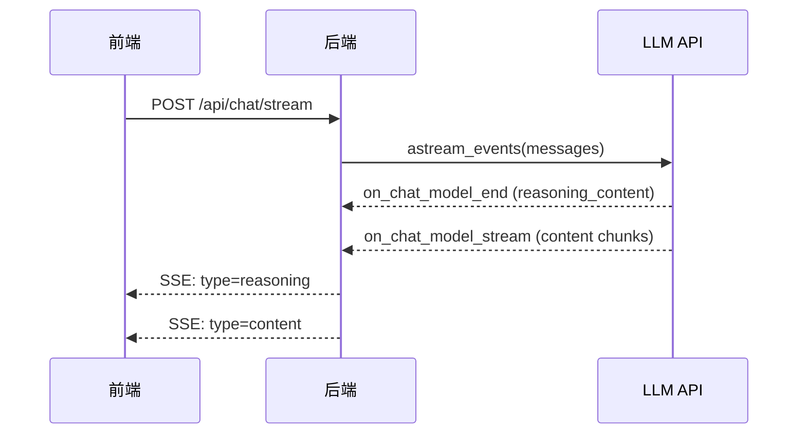
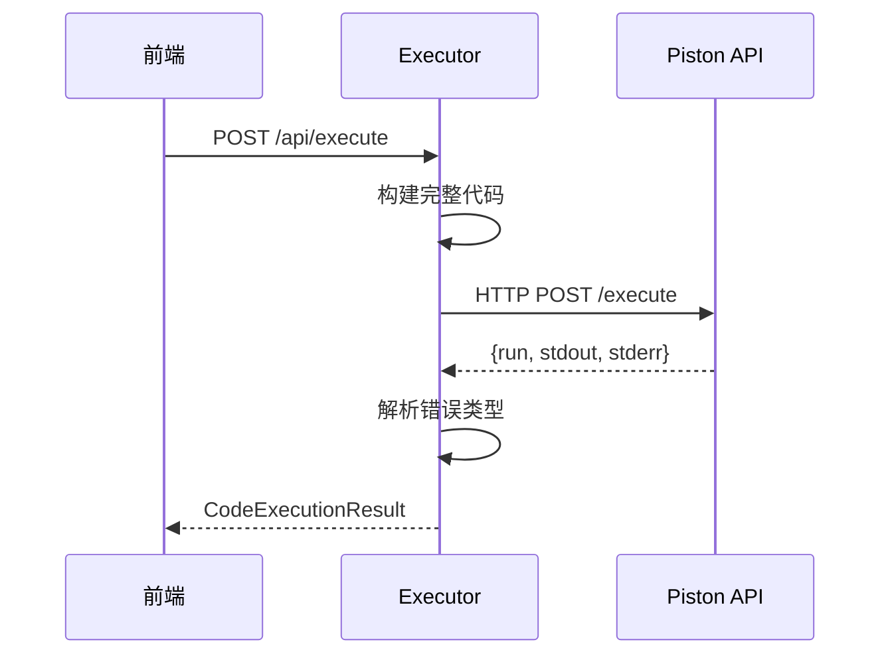
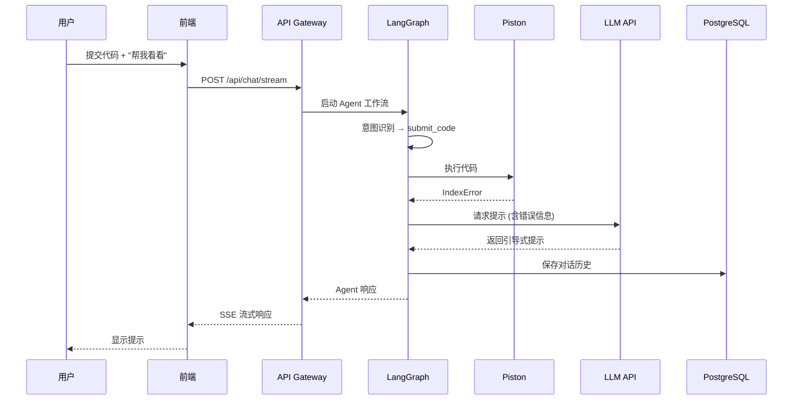
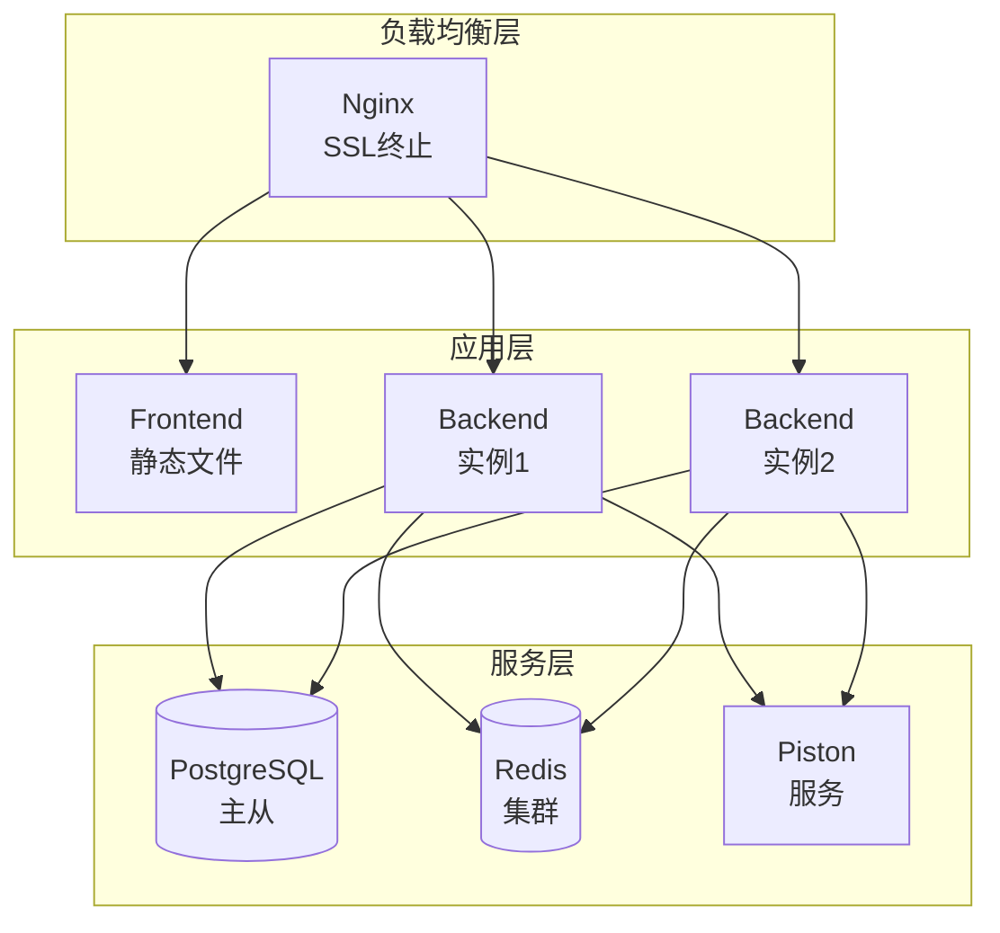

# AlgoStone 架构设计文档

> 本文档描述 AlgoStone 系统的技术架构，包括核心模块、数据流和扩展性考虑。

---

## 系统架构概览



---

## 技术栈

### 前端
| 技术 | 版本 | 用途 |
|------|------|------|
| React | 18+ | UI框架 |
| TypeScript | 5+ | 类型安全 |
| Vite | 6+ | 构建工具 |
| Monaco Editor | - | 代码编辑器 |
| Shadcn UI | - | UI组件库 |

### 后端
| 技术 | 版本 | 用途 |
|------|------|------|
| Python | 3.10+ | 运行时 |
| FastAPI | 0.115+ | Web框架 |
| LangGraph | 0.3+ | Agent工作流 |
| LangChain | 1.0+ | LLM集成 |
| Pydantic | 2.10+ | 数据验证 |

### 基础设施
| 组件 | 技术 | 用途 |
|------|------|------|
| 数据库 | PostgreSQL + pgvector | 数据存储、向量检索 |
| 缓存 | Redis | 会话缓存 |
| 代码沙箱 | Piston API | 安全代码执行 |
| 容器化 | Docker + Docker Compose | 开发环境 |

---

## 核心模块详解

### 1. LangGraph 状态机

**文件位置**: `backend/langgraph_agent/graph.py`

LangGraph 是整个系统的核心，负责编排 AI 助手的对话流程。

#### 工作流程图



#### 状态定义 (`AgentState`)

```python
class AgentState(TypedDict):
    # 会话信息
    session_id: str
    problem_id: Optional[str]
    user_message: str
    user_code: Optional[str]
    conversation_history: List[Dict]

    # 动态 LLM 配置 (前端发送)
    api_key: Optional[str]
    model_name: Optional[str]
    api_base: Optional[str]

    # Agent 状态
    intent: Optional[IntentType]  # 提交代码/询问概念/请求提示
    has_error: bool
    error_type: Optional[str]
    error_message: Optional[str]

    # 提示系统
    current_hint_level: int
    hints_given: List[str]
    max_hint_reached: bool

    # 执行结果
    execution_result: Optional[Dict]
    test_passed: bool
    retrieved_docs: List[Dict]

    # 输出
    agent_response: str
    current_node: str
    attempt_count: int
    should_end: bool
```

#### 节点说明

| 节点 | 文件 | 功能 |
|------|------|------|
| `intent_recognition_node` | `nodes.py` | 使用规则匹配识别用户意图 |
| `error_diagnosis_node` | `nodes.py` | 分析代码语法错误 |
| `stepwise_hint_node` | `nodes.py` | 调用 LLM 生成回复 |
| `code_comparison_node` | `nodes.py` | 决定是否继续提示 |

---

### 2. LLM 集成

**文件位置**: `backend/langgraph_agent/llm.py`

系统支持任何 OpenAI 兼容的 API，包括：

- OpenAI (GPT-4, GPT-4o-mini)
- DeepSeek (deepseek-chat, deepseek-reasoner)
- 阿里云通义千问 (qwen-plus, qwen-turbo)
- 其他兼容 OpenAI API 格式的服务

#### 动态配置

用户可通过前端设置 API 配置，后端使用 `get_dynamic_llm()` 创建实例：

```python
def get_dynamic_llm(
    api_key: str,
    model_name: str,
    api_base: str,
    streaming: bool = False,
) -> BaseChatModel:
    """使用前端发送的配置创建 LLM 实例"""
    return ChatOpenAI(
        model=model_name,
        api_key=api_key,
        base_url=api_base,
        streaming=streaming,
    )
```

#### 推理内容显示

支持 DeepSeek-R1 等推理模型的 `reasoning_content` 字段：



前端在消息中显示可折叠的"思考过程"面板。

---

### 3. 代码沙箱

**文件位置**: `backend/sandbox/sandbox_executor.py`

使用 Piston API 执行代码，提供：

- 安全隔离（独立容器）
- 超时控制（默认 10 秒）
- 多语言支持（Python, JavaScript, Go 等）
- 错误类型映射

#### 执行流程



#### 错误类型映射

| Python 异常 | 映射类型 |
|-------------|----------|
| `IndexError` | `IndexError` |
| `KeyError` | `KeyError` |
| `RecursionError` | `RecursionError` |
| `SyntaxError` | `SyntaxError` |
| `IndentationError` | `IndentationError` |
| `TypeError` | `TypeError` |
| `ValueError` | `ValueError` |
| `NameError` | `NameError` |

---

### 4. API 路由

**文件位置**: `backend/app/api/routes/`

| 路由 | 方法 | 功能 |
|------|------|------|
| `/chat/send` | POST | 非流式聊天 |
| `/chat/stream` | POST | 流式聊天 (SSE) |
| `/chat/history/{session_id}` | GET/DELETE | 会话历史管理 |
| `/execute` | POST | 单次代码执行 |
| `/submit` | POST | 提交代码（所有测试） |
| `/problems` | GET | 获取题目列表 |
| `/health` | GET | 健康检查 |

#### 流式聊天响应格式

```
data: {"type": "start", "session_id": "..."}

data: {"type": "intent", "intent": "submit_code"}

data: {"type": "diagnosis", "has_error": true}

data: {"type": "reasoning", "content": "..."}  # 推理过程 (可选)

data: {"type": "content", "content": "回复片段"}

data: {"type": "end"}
```

---

### 5. 数据库 Schema

**文件位置**: `backend/app/models/sql_models.py`

```sql
-- 题目表
CREATE TABLE problems (
    id TEXT PRIMARY KEY,
    title TEXT NOT NULL,
    difficulty TEXT,
    description TEXT,
    examples JSONB,
    constraints TEXT,
    starter_code TEXT
);

-- 用户代码提交表
CREATE TABLE code_submissions (
    id SERIAL PRIMARY KEY,
    user_id TEXT,
    problem_id TEXT,
    code TEXT,
    language TEXT,
    passed BOOLEAN,
    created_at TIMESTAMP
);

-- 聊天消息表
CREATE TABLE chat_messages (
    id SERIAL PRIMARY KEY,
    session_id TEXT,
    task_id TEXT,
    role TEXT,
    content TEXT,
    created_at TIMESTAMP
);

-- 用户进度表
CREATE TABLE user_progress (
    user_id TEXT PRIMARY KEY,
    solved_problems TEXT[],  -- 已解决的题目ID数组
    last_active TIMESTAMP
);
```

---

## 数据流示例

### 场景: 学生提交错误代码



---

## 部署架构

### 开发环境

```
localhost:3000  → 前端 (Vite dev server)
localhost:8001  → 后端 (uvicorn)
localhost:27123 → Piston (Docker)
localhost:5432  → PostgreSQL (Docker)
localhost:6379  → Redis (Docker)
```

### 生产环境建议



---

## 扩展性考虑

### 1. 多语言支持

当前使用 Piston API，原生支持 70+ 编程语言。扩展只需：

1. 前端添加语言选择器
2. 更新 `language_id` 参数

### 2. 自定义题库

已支持通过 API 上传题目：

```python
POST /api/problems
{
    "title": "两数之和",
    "difficulty": "Easy",
    "description": "...",
    "examples": [...],
    "starter_code": "def solution(): ..."
}
```

### 3. RAG 知识库

**文件位置**: `backend/langgraph_agent/rag.py`

- Parent Document Retrieval 策略
- PostgreSQL + pgvector 向量存储
- 支持题解、知识点检索

---

## 安全考虑

### 已实现

| 安全措施 | 状态 |
|----------|------|
| 代码沙箱隔离 | ✅ Piston Docker 容器 |
| 速率限制 | ✅ slowapi |
| 输入验证 | ✅ Pydantic |
| SQL 注入防护 | ✅ 参数化查询 |
| 错误信息脱敏 | ✅ sanitize_for_log |

### 待实现

| 安全措施 | 状态 |
|----------|------|
| JWT 认证 | ⏳ TODO |
| CORS 白名单 | ⏳ TODO |
| 敏感数据加密 | ⏳ TODO |

---

## 性能优化

### 1. LLM 调用

- ✅ 流式响应（减少首字延迟感知）
- ✅ max_tokens=1024（控制响应长度）
- ⏳ 响应缓存（计划中）

### 2. 数据库

- ✅ 连接池
- ✅ 索引优化
- ⏳ 查询结果缓存

### 3. 前端

- ✅ 代码自动防抖保存
- ✅ 虚拟滚动（题目列表）
- ⏳ Service Worker 缓存

---

## 监控指标

| 指标 | 目标 |
|------|------|
| API 响应时间 | P95 < 2s |
| 代码执行时间 | < 10s |
| LLM 首字延迟 | < 5s |
| 错误率 | < 1% |

---

## 相关文档

- [部署指南](DEPLOYMENT.md) - 如何部署和运行系统
- [用户指南](USER_GUIDE.md) - 终端用户使用说明
- [API 文档](API.md) - API 接口详细说明
- [产品需求文档](PRD.md) - 产品需求和功能定义
